# using-mmdetection-for-traning-your-own-datasets-by-changing-some-parameter


## 1 安装


### 1.1 依赖

- Linux 和 macOS （Windows 理论上支持）
- Python 3.7 +
- PyTorch 1.3+
- CUDA 9.2+ （如果基于 PyTorch 源码安装，也能够支持 CUDA 9.0）
- GCC 5+
- MMCV


###  	1.2 具体流程

---

#### 1.2.1 准备环境

(1) 打开anaconda命令行，使用 conda 新建虚拟环境，并进入该虚拟环境:

```shell
conda create -n mmlab python=3.7 -y
conda activate mmlab
```

(2) 在 [PyTorch 官网](https://pytorch.org/)找到对应版本的shell安装命令并运行安装指令 (以windows、cuda11.6为例):

```shell
conda install pytorch torchvision torchaudio pytorch-cuda=11.6 -c pytorch -c nvidia
```

**注**：需要确保 CUDA 的编译版本和运行版本匹配。可以在 PyTorch 官网查看预编译包所支持的 CUDA 版本。建议直接在官网下载预购建好的CUDA版本，避免手动安装造成版本不兼容。

#### 1.2.2 安装mmdetection 

建议使用官方提供的 [MIM](https://github.com/open-mmlab/mim) 来安装 MMDetection：

```shell
pip install openmim
mim install mmdet
```

MIM 能够自动地安装 OpenMMLab 的所有项目以及对应的依赖包。

---

如果安装失败，可以选择**手动安装**，比较复杂，需要先使用 `mim uninstall mmdet` 卸载已安装的mmcv ，然后参考[官方文档](docs/zh_cn/get_started.md/#Installation)手动进行安装：

1. 安装 mmcv-full，我们建议使用预构建包来安装：

   ```shell
   pip install mmcv-full -f https://download.openmmlab.com/mmcv/dist/{cu_version}/{torch_version}/index.html
   ```

   需要把命令行中的 `{cu_version}` 和 `{torch_version}` 替换成对应的版本。例如：在 CUDA 11 和 PyTorch 1.7.0 的环境下，可以使用下面命令安装最新版本的 MMCV：

   ```shell
   pip install mmcv-full -f https://download.openmmlab.com/mmcv/dist/cu110/torch1.7.0/index.html
   ```

   请参考 [MMCV](https://mmcv.readthedocs.io/en/latest/#installation) 获取不同版本的 MMCV 所兼容的的不同的 PyTorch 和 CUDA 版本。同时，也可以通过以下命令行从源码编译 MMCV：

   ```shell
   git clone https://github.com/open-mmlab/mmcv.git
   cd mmcv
   MMCV_WITH_OPS=1 pip install -e .  # 安装好 mmcv-full
   cd ..
   ```

   或者，可以直接使用命令行安装：

   ```shell
   pip install mmcv-full
   ```

   PyTorch 在 1.x.0 和 1.x.1 之间通常是兼容的，故 mmcv-full 只提供 1.x.0 的编译包。如果你的 PyTorch 版本是 1.x.1，你可以放心地安装在 1.x.0 版本编译的 mmcv-full。

   ```
   # 我们可以忽略 PyTorch 的小版本号
   pip install mmcv-full -f https://download.openmmlab.com/mmcv/dist/cu110/torch1.7/index.html
   ```

2. 安装 MMDetection：

   你可以直接通过如下命令从 pip 安装使用 mmdetection:

   ```shell
   pip install mmdet
   ```

   或者从 git 仓库编译源码

   ```shell
   git clone https://github.com/open-mmlab/mmdetection.git
   cd mmdetection
   pip install -r requirements/build.txt
   pip install -v -e .  # or "python setup.py develop"
   ```

3. 安装额外的依赖以使用 Instaboost, 全景分割, 或者 LVIS 数据集

   ```shell
   # 安装 instaboost 依赖
   pip install instaboostfast
   # 安装全景分割依赖
   pip install git+https://github.com/cocodataset/panopticapi.git
   # 安装 LVIS 数据集依赖
   pip install git+https://github.com/lvis-dataset/lvis-api.git
   # 安装 albumentations 依赖
   pip install -r requirements/albu.txt
   ```

**注：**官方文档的安装步骤是基于linux的，我是在windows下用mim成功安装了，就没有经过这一步，所以可行性有待验证。


#### 1.2.3 下载工具包

在GitHub上下载[mmdetection-master](https://github.com/open-mmlab/mmdetection)项目源码并解压


## 2 前期准备


### 2.1 认识工具包

在pycharm中打开mmdetection-master项目文件夹，其中主要文件夹的作用如下：

|   文件夹名   |                             作用                             |
| :----------: | :----------------------------------------------------------: |
|   configs    | 主要的功能包，可在其中找到大部分图像分割/实例分割/全景分割功能包 |
|     demo     |        官方提供的几个小案例，在接下来的测试中需要用到        |
|     docs     |                      官方提供的教程目录                      |
|    mmdet     | 存放main函数的核心源码，请慎重修改此文件夹，修改前务必做好备份 |
| requirements | 该工具包需要的一些依赖环境，如果是用官方的mim安装，所需的环境就都已经搭建好了 |
|  resources   |          官方的本地图片文件夹，可忽略，最好不要删除          |
|    tests     | 官方提供的测试文件夹，我们自己的测试文件也可以放在该文件夹下 |
|    tools     |               官方提供的工具文件夹，请慎重修改               |

我们需要在该项目里新建下列文件夹，便于之后使用：

|  文件夹名   |                         作用                         |
| :---------: | :--------------------------------------------------: |
| checkpoints | 用于保存官方训练好的一些权重文件，之后测试中需要用到 |
|    data     |           用于存放自己训练时的数据集和模型           |


### 2.2 测试项目是否能正常使用

为了验证mmdet是否安装成功，请按照下述步骤进行测试：

(1) 在pycharm中找到 `/mmdetection-master/demo`文件夹下的`image_demo.py`文件并打开，按住ctrl+F打开搜索栏，输入`device`，找到这一行代码：

```python
parser.add_argument(
    '--device', default='cuda:0', help='Device used for inference')
```

​	如果电脑没有gpu，需要把`default='cuda:0'`修改为`default='cpu'`;

(2) 以mask_rcnn为例，测试工具包是否正常安装并能使用：

​		首先我们要下载预训练好的权重文件：

​		找到[configs/mask_rcnn/README.md](https://github.com/open-mmlab/mmdetection/blob/master/configs/mask_rcnn/README.md)并打开，找到download下的model，点击下载`mask_rcnn_r50_fpn_1x_coco_20200205-d4b0c5d6.pth`，并存放在之前我们创建好的checkpoints文件夹下；

---

**注1：**模型与权重文件必须相对应，比如我这里用的是mask_rcnn_r50_fpn_1x_coco.py，那权重文件就必须下载mask_rcnn_r50_fpn_1x_coco这一栏对应的（如下图）。

**注：**官方已经给我们准备好了所有的预训练文件。在configs文件夹中，你需要哪个模型，就可以点进该模型子文件夹中的readme.md，在里面找到并下载对应的权重文件。

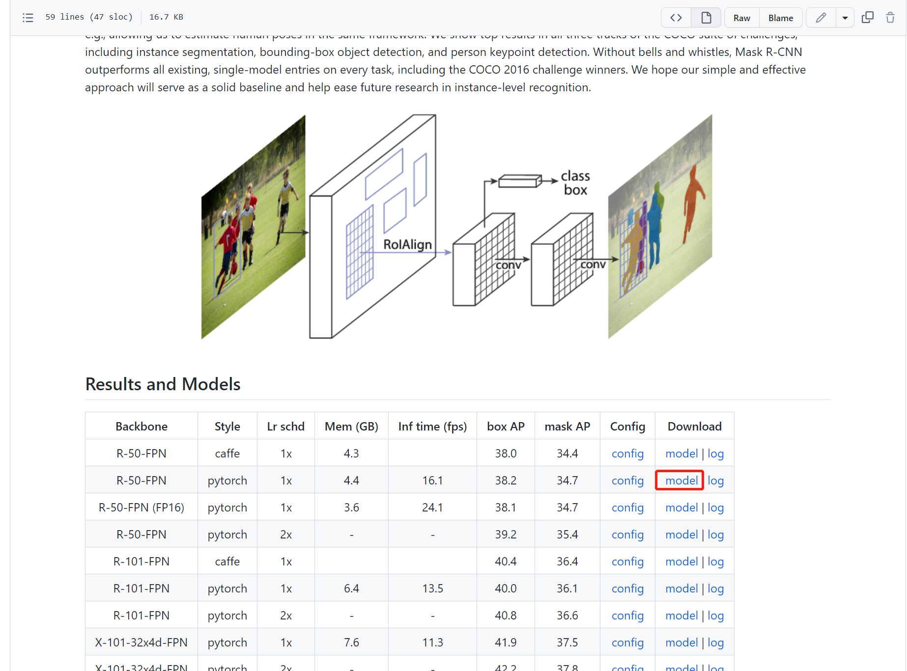


​		然后，回到pycharm，找到`configs\mask_rcnn\mask_rcnn_r50_fpn_1x_coco.py`这个文件，复制路径；

​		最后一步，找到`demo\image_demo.py`这个脚本，复制路径， 最后在terminal内输入

```shell
conda activate mmlab
python demo/image_demo.py demo/demo.jpg configs/mask_rcnn/mask_rcnn_r50_fpn_1x_coco.py checkpoints/mask_rcnn_r50_fpn_1x_coco_20200205-d4b0c5d6.pth  # 注：python+demo路径+图片路径+模型路径+checkpoints权重路径
```


利用官方提供的demo和训练好的权重文件，分割出的结果如下：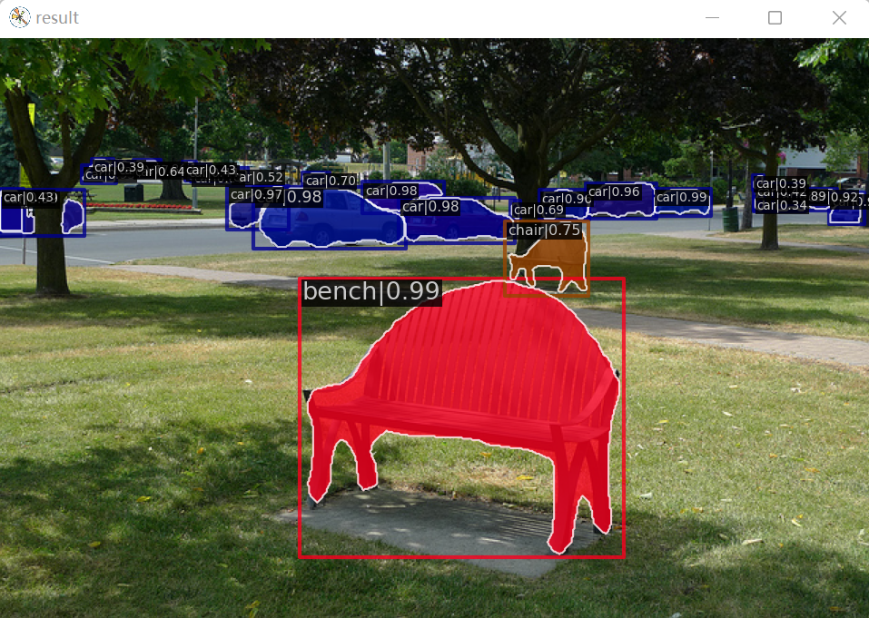

如果代码能够成功运行，那么我们安装的工具包就能正常使用了。

利用MMdetection，通过组合不同的模块组件，我们可以便捷地构建自己训练的模型和数据集，来自定义自己的检测模型。


## 3 快速训练


### 3.1 使用已有模型与标准数据集进行检测

在[2.2](# 2.2 测试工具包是否能正常使用) 中，我们已经了解到，如何使用demo和现有模型和数据集对图片进行实例分割。接下来尝试利用官方提供的demo，进行视频检测。

#### 3.1.1 视频检测

官方同样也提供了一个视频检测的demo，具体步骤和之前检测图片的类似：

依然以mask_rcnn_r50_fpn_1x为例，首先在configs文件夹中找到[configs/mask_rcnn/README.md](https://github.com/open-mmlab/mmdetection/blob/master/configs/mask_rcnn/README.md)并打开，下载已经训练好的model：`mask_rcnn_r50_fpn_1x_coco_20200205-d4b0c5d6.pth`，并存放在checkpoints文件夹下；

回到pycharm，找到这个权重文件对应的configs配置文件`configs/mask_rcnn/mask_rcnn_r50_fpn_1x_coco.py`，注意两者之间需要对应；

然后找到`demo/image_demo.py`文件，在terminal内输入

```shell
conda activate mmlab
python demo/video_demo.py demo/demo.mp4 configs/mask_rcnn/mask_rcnn_r50_fpn_1x_coco.py checkpoints/mask_rcnn_r50_fpn_1x_coco_20200205-d4b0c5d6.pth --show		# 注：展示是--show  保存检测后输出的文件是--output
```

运行的结果如下：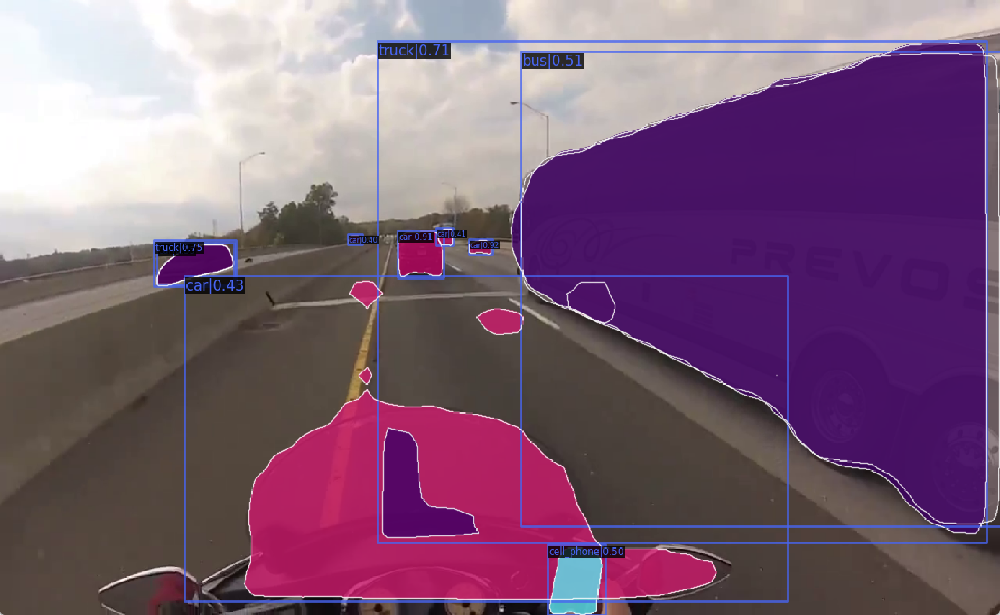


### 3.2 在自定义数据集上进行训练


mmdet的数据集支持 coco格式和 voc 格式, 但 voc 格式官方只自带了少量网络模型文件, 所以推荐使用coco 格式的数据集。首先来制作自己的coco格式的数据集。


#### 3.2.1 数据集准备

**注：**如果你已经准备好了自己的coco格式的数据集，请直接跳到到[3.2.2 训练模型准备](# 3.2.2 训练模型准备)

为了避免跟上面的mmlab环境里的包有冲突，在这一步里，我们重新创建一个新的**环境**和一个新的**项目**：

---

(1) 在anaconda命令行下创建一个新的环境labelme，并进入该虚拟环境:

```shell
conda create -n labelme python=3.6 -y
conda activate labelme
```

**注：**这个环境的python解释器请安装3.6以下的版本，以兼容老版本的opencv

(2) 安装labelme：

```shell
pip install labelme -i https://mirrors.aliyun.com/pypi/simple/
```

(3) 安装opencv：

```shell
conda install opencv=3.4.1
```

---

**(2023/2/18)注：**我一直用的opencv都是3.4.1这个版本。但是现在走pip安装会报错（可能是pip不再支持安装opencv的老版本了，但是opencv在3.8.x之后的绝大多数包都申请专利，目前已无法使用）。这里用conda还能安装，暂时先这样处理吧。

(4) 新建项目

因为在下面的步骤中（[图片预处理](# 1、图片预处理) 和 [labelme数据集转coco数据集](# 3、labelme数据集转coco数据集)）有几个脚本需要运行一下，所以新建一个专门用来处理数据集的项目，处理完数据集后把数据集文件夹复制到mmdetection的data目录下。


##### 1、图片预处理

在制作数据集之前，我们首先要规范图片文件夹内的所有图片。这里主要有两个步骤：重命名和更改图片分辨率。

**注：**如果你的图片名称格式和图片大小已经处理好了，可以直接跳过这一步，转到下面[labelme的使用](# 2、labelme的使用)。

(1) rename

​		这一步主要有两个作用，第一，把图片名称规范排好；第二，把图片后缀统一为jpg格式。（png格式的图片占用内存较大，在这一步改好可以省去后续步骤的很多麻烦）。这里提供一个批量重命名的脚本`rename.py`使用：

```python
import os

path = r'E:\python\python_project\mogushujuji\yuantu'	# 这里修改成你自己的图片目录
index = 1	
for file in os.listdir(path):
    file_path = os.path.join(path, file)
    if os.path.splitext(file_path)[-1] == '.jpg':
        new_file_path = '/'.join((os.path.splitext(file_path)[0].split('\\'))[:-1]) + '/{:0>2}.jpg'.format(index)
        # 注：我这里只有50张图片，如果你有100张以上的图片，请把'/{:0>2}.jpg'改成'/{:0>3}.jpg'，以此类推，下面同理
        index += 1
        print(file_path+'---->'+new_file_path)
        os.rename(file_path, new_file_path)
    elif os.path.splitext(file_path)[-1] == '.png':
        new_file_path = '/'.join((os.path.splitext(file_path)[0].split('\\'))[:-1]) + '/{:0>2}.jpg'.format(index)
        index += 1
        print(file_path + '---->' + new_file_path)
        os.rename(file_path, new_file_path)
```

(2) resize

​		这一步的作用是把所有图片大小统一，同时为了节省内存，我们尽量把分辨率调小一点。同样提供一个`resize.py`脚本使用：

```python
import os
import cv2

img_path = r"E:\python\python_project\mogushujuji\yuantu"   # 这里修改成你自己的图片目录
path = os.path.join(img_path)
img_list = os.listdir(path)

index = 0
for i in img_list:
    print(os.path.join(path, i))
    old_img = cv2.imread(os.path.join(path, i))
    new_img = cv2.resize(old_img, (300, 400))	# 修改后的图片分辨率大小，数值可以自己修改，这里大小要记住，后面要用到
    index = index + 1
    cv2.imwrite(r"E:\python\python_project\mogushujuji\image\{}.jpg".format(index), new_img) # 这里修改成你自己输出的resize后的文件夹
```

**注：**以上两个脚本，路径名不能有中文，否则报错。

运行完成之后，在当前文件夹下会新建一个image文件夹，里面存放着已经规范化的图片。

##### 2、labelme的使用

(1) 进入labelme环境：输入`labelme`，会弹出labelme的界面窗口。

```shell
conda activate labelme
labelme
```

在正式开始标注前，点击File->Save Automatically勾选自动保存。**点击Change Output Dir选择输出json文件的目录。这里一定要确认，输出目录与我们要打标签的图片是同一目录。**例如：我的图片文件夹是`E:\python\python_project\mogushujuji\image`，那我输出的文件夹也一定要是这个，这一步非常重要，否则你输出的json文件，无法一一对应到你的图片。

---

(2) 点击界面左侧的`opendir`，选择我们之前预处理好的图片文件夹：`E:\python\python_project\mogushujuji\image`

(3) 打开文件夹之后，界面中间出现需要标注的第一张图片。此时`Create Polygons`变得高亮，点击`Create Polygons`之后，在图片上依次点击，框出需要标记的边界框。边界框首尾相连后会弹出命名标签的窗口，可以在弹出窗口中新建标签名，也可以在窗口下方选择已有的标签名。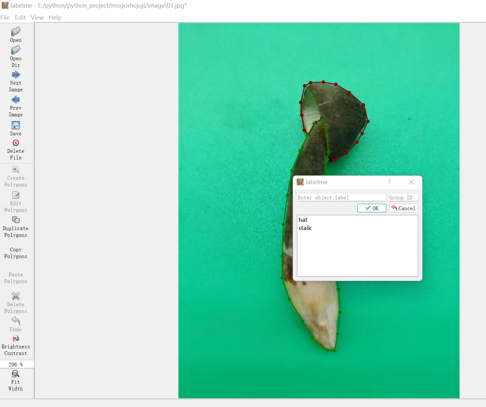

**注：标记时如果产生遮挡，不要凭空想象其轮廓，在图片上有多少就圈多少出来**

---

(4) 这张图片打完标记后点击Next Image， 跳转到下一张图片，重复上述步骤，直到完成所有图片的标记。

**注：**勾勒轮廓时，如果不小心点错了可以按ctrl+z退回上个勾勒点。如果需要删除或者移动边界框，点击Edit Polygons，再点击需要修改的框的中间，进行编辑操作。

(6) 所有图片标记完成后，直接关闭labelme的窗口，打开图片目录`E:\python\python_project\mogushujuji\image`检查，会发现里面多了与图片**同样名称、同样数量**的、后缀为json的文件：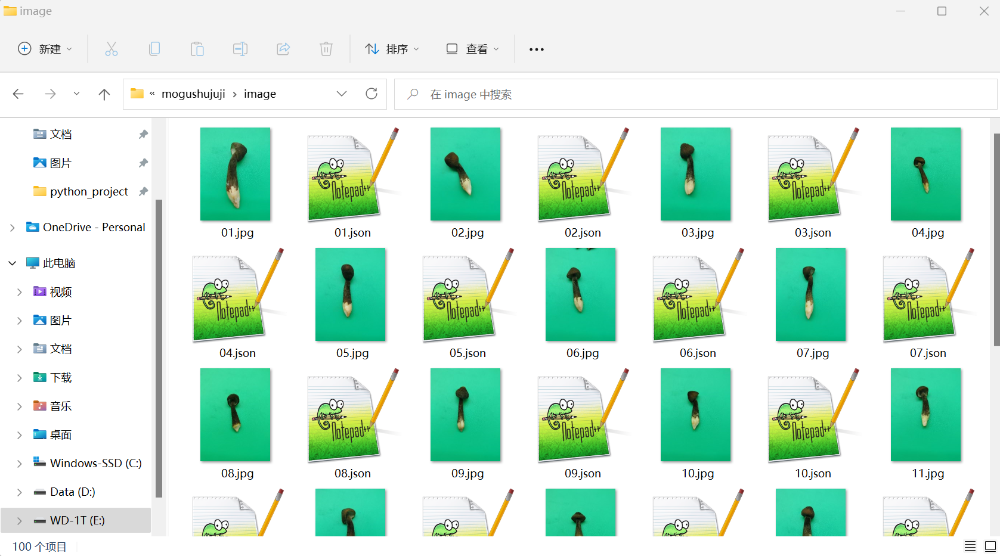

**注：**jpg与json文件名和数量都是一一对应的，如果缺少了，请重新回到labelme窗口，确保每张图片都已经打好了标签。


##### 3、labelme数据集转coco数据集

由于mmdetection不支持labelme数据集格式，所以这里提供脚本`labelme2coco.py`，把labelme数据集转成coco数据集。

```python
import os
import json
import numpy as np
import glob
import shutil
import cv2
from sklearn.model_selection import train_test_split

np.random.seed(41)

# 0为背景,标记号直接从1开始
classname_to_id = {
    "hat": 1,
    "stalk": 2,

}	 	# 这里把classname改成你的数据集的标签名，顺序随意


class Lableme2CoCo:

    def __init__(self):
        self.images = []
        self.annotations = []
        self.categories = []
        self.img_id = 0
        self.ann_id = 0

    def save_coco_json(self, instance, save_path):
        json.dump(instance, open(save_path, 'w', encoding='utf-8'), ensure_ascii=False, indent=1)  # indent=2 更加美观显示

    # 由json文件构建COCO
    def to_coco(self, json_path_list):
        self._init_categories()
        for json_path in json_path_list:
            obj = self.read_jsonfile(json_path)
            self.images.append(self._image(obj, json_path))
            shapes = obj['shapes']
            for shape in shapes:
                annotation = self._annotation(shape)
                self.annotations.append(annotation)
                self.ann_id += 1
            self.img_id += 1
        instance = {}
        instance['info'] = 'spytensor created'
        instance['license'] = ['license']
        instance['images'] = self.images
        instance['annotations'] = self.annotations
        instance['categories'] = self.categories
        return instance

    # 构建类别
    def _init_categories(self):
        for k, v in classname_to_id.items():
            category = {}
            category['id'] = v
            category['name'] = k
            self.categories.append(category)

    # 构建COCO的image字段
    def _image(self, obj, path):
        image = {}
        from labelme import utils
        img_x = utils.img_b64_to_arr(obj['imageData'])
        h, w = img_x.shape[:-1]
        image['height'] = h
        image['width'] = w
        image['id'] = self.img_id
        image['file_name'] = os.path.basename(path).replace(".json", ".jpg")
        return image

    # 构建COCO的annotation字段
    def _annotation(self, shape):
        # print('shape', shape)
        label = shape['label']
        points = shape['points']
        annotation = {}
        annotation['id'] = self.ann_id
        annotation['image_id'] = self.img_id
        annotation['category_id'] = int(classname_to_id[label])
        annotation['segmentation'] = [np.asarray(points).flatten().tolist()]
        annotation['bbox'] = self._get_box(points)
        annotation['iscrowd'] = 0
        annotation['area'] = 1.0
        return annotation

    # 读取json文件，返回一个json对象
    def read_jsonfile(self, path):
        with open(path, "r", encoding='utf-8') as f:
            return json.load(f)

    # COCO的格式： [x1,y1,w,h] 对应COCO的bbox格式
    def _get_box(self, points):
        min_x = min_y = np.inf
        max_x = max_y = 0
        for x, y in points:
            min_x = min(min_x, x)
            min_y = min(min_y, y)
            max_x = max(max_x, x)
            max_y = max(max_y, y)
        return [min_x, min_y, max_x - min_x, max_y - min_y]


if __name__ == '__main__':
    labelme_path = "./image"	# 这里的路径改成你自己的数据集路径，我这里的绝对路径是：
    							# E:\python\python_project\mogushujuji\image
    saved_coco_path = "./"	# 这里默认就好，意思是在当前项目下新建一个名为coco的文件夹
    print('reading...')
    # 创建文件
    if not os.path.exists("%scoco/annotations/" % saved_coco_path):
        os.makedirs("%scoco/annotations/" % saved_coco_path)
    if not os.path.exists("%scoco/train2017/" % saved_coco_path):
        os.makedirs("%scoco/train2017" % saved_coco_path)
    if not os.path.exists("%scoco/val2017/" % saved_coco_path):
        os.makedirs("%scoco/val2017" % saved_coco_path)
    # 获取image目录下所有的json文件列表
    json_list_path = glob.glob(labelme_path + "./*.json")
    print('json_list_path: ', len(json_list_path))
    # 数据划分
    train_path, val_path = train_test_split(json_list_path, test_size=0.1, train_size=0.9)	# 这里更改训练集和测试集的比例
    print("train_n:", len(train_path), 'val_n:', len(val_path))

    # 把训练集转化为COCO的json格式
    l2c_train = Lableme2CoCo()
    train_instance = l2c_train.to_coco(train_path)
    l2c_train.save_coco_json(train_instance, '%scoco/annotations/instances_train2017.json' % saved_coco_path)
    for file in train_path:
        # shutil.copy(file.replace("json", "jpg"), "%scoco/images/train2017/" % saved_coco_path)
        img_name = file.replace('json', 'jpg')
        img_name = img_name[-6:]		# 如果你的数据集数量是三位数，这里把-6改成-7，依次类推
        temp_img = cv2.imread(os.path.join('image', img_name))
        try:
            cv2.imwrite("{}coco/train2017/{}".format(saved_coco_path, img_name.replace('png', 'jpg')),temp_img)
        except Exception as e:
            print(e)
            print('Wrong Image:', img_name)
            continue
        print(img_name + '-->', img_name.replace('png', 'jpg'))

    for file in val_path:
        # shutil.copy(file.replace("json", "jpg"), "%scoco/images/val2017/" % saved_coco_path)
        img_name = file.replace('json', 'jpg')
        img_name = img_name[-6:]		# 如果你的数据集数量是三位数，这里把-6改成-7，依次类推
        temp_img = cv2.imread(os.path.join('image', img_name))
        try:
            cv2.imwrite("{}coco/val2017/{}".format(saved_coco_path, img_name.replace('png', 'jpg')), temp_img)
        except Exception as e:
            print(e)
            print('Wrong Image:', img_name)
            continue
        print(img_name + '-->', img_name.replace('png', 'jpg'))

    # 把验证集转化为COCO的json格式
    l2c_val = Lableme2CoCo()
    val_instance = l2c_val.to_coco(val_path)
    l2c_val.save_coco_json(val_instance, '%scoco/annotations/instances_val2017.json' % saved_coco_path)
```

---

**注1：**脚本需要更改的地方较多，要更改的地方已经在文件内注释出来了，主要有4处：

```shell
	1.  line 14  把类别替换成你的数据集标签（顺提一嘴，coco数据集最多支持80个类别）；
	2.  line 104 把labelme_path改成你自己的数据集路径；
	3.  line 118 更改训练集和测试集的比例，按你的需求更改；
	4.  line 128 and 141 如果你的数据集有100~999张，把-6换成-7；有1000~9999张则换成-8，依次类推。
```

**注2：**sklearn应该需要安装一下，在terminal内输入如下代码：

```shell
conda update scikit-learn
```

然后pycharm内直接运行`labelme2coco.py`，如果这个脚本正常运行，在项目文件夹内会出现一个coco文件夹，格式如下：

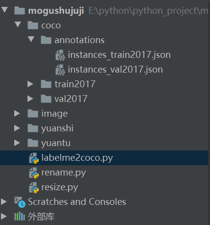

标准的coco格式的数据集文件夹中有3个子文件夹：1.annotations下面是两个json文件，分别是训练集和测试集打好的标签

​																						2.train2017是训练集的图片

​																						3.val2017是测试集的图片

如果是用其他方法做出来的coco数据集，也要遵循上面这个文件夹的格式。

最后，我们把生成的coco数据集的整个文件夹`./coco`复制到`mmdetection-master/data`下(data文件夹是在[2.1 认识工具包](# 2.1 认识工具包)中新建的)，接下来进行训练的步骤。


#### 3.2.2 训练模型准备

在[2.2](# 2.2 测试工具包是否能正常使用)中，我们已经下载好了`mask_rcnn_r50_fpn_1x_coco_20200205-d4b0c5d6.pth`在checkpoints文件夹下。下面的训练中，我们还是用这个模型来做示范。如果你需要用其他预训练好的模型，请自行准备或参照前文方法下载官方提供的预训练模型。

#### 3.2.3 开始训练

##### 1、修改配置文件

因为coco数据集中有80个分类，我们首先要修改源码，之前有提到，修改mmdet下的代码要慎重，所以我们修改的时候不要直接删除官方源码，需要修改的地方注释掉，或者在修改之前做好备份。

(1) 修改`mmdetection-master/mmdet/core/evalution/class_names.py` 中第68行的coco_classes类：注释掉官方的80个分类，换成自己的分类：

```python
def coco_classes():
    return [
        'hat', 'stalk'		# 把这里的类别替换成你自己的。我这里只分了两个类
    ]
    # return [
    #     'person', 'bicycle', 'car', 'motorcycle', 'airplane', 'bus', 'train',
    #     'truck', 'boat', 'traffic_light', 'fire_hydrant', 'stop_sign',
    #     'parking_meter', 'bench', 'bird', 'cat', 'dog', 'horse', 'sheep',
    #     'cow', 'elephant', 'bear', 'zebra', 'giraffe', 'backpack', 'umbrella',
    #     'handbag', 'tie', 'suitcase', 'frisbee', 'skis', 'snowboard',
    #     'sports_ball', 'kite', 'baseball_bat', 'baseball_glove', 'skateboard',
    #     'surfboard', 'tennis_racket', 'bottle', 'wine_glass', 'cup', 'fork',
    #     'knife', 'spoon', 'bowl', 'banana', 'apple', 'sandwich', 'orange',
    #     'broccoli', 'carrot', 'hot_dog', 'pizza', 'donut', 'cake', 'chair',
    #     'couch', 'potted_plant', 'bed', 'dining_table', 'toilet', 'tv',
    #     'laptop', 'mouse', 'remote', 'keyboard', 'cell_phone', 'microwave',
    #     'oven', 'toaster', 'sink', 'refrigerator', 'book', 'clock', 'vase',
    #     'scissors', 'teddy_bear', 'hair_drier', 'toothbrush'
    # ]
```

(2) 同样也要修改 `mmdetection-master/mmdet/datasets/coco.py`中第23行的CocoDataset类，注释掉这80个分类，换成自己的分类。下面的PALETTE也要注释掉：

```python
class CocoDataset(CustomDataset):

    # CLASSES = ('person', 'bicycle', 'car', 'motorcycle', 'airplane', 'bus',
    #            'train', 'truck', 'boat', 'traffic light', 'fire hydrant',
    #            'stop sign', 'parking meter', 'bench', 'bird', 'cat', 'dog',
    #            'horse', 'sheep', 'cow', 'elephant', 'bear', 'zebra', 'giraffe',
    #            'backpack', 'umbrella', 'handbag', 'tie', 'suitcase', 'frisbee',
    #            'skis', 'snowboard', 'sports ball', 'kite', 'baseball bat',
    #            'baseball glove', 'skateboard', 'surfboard', 'tennis racket',
    #            'bottle', 'wine glass', 'cup', 'fork', 'knife', 'spoon', 'bowl',
    #            'banana', 'apple', 'sandwich', 'orange', 'broccoli', 'carrot',
    #            'hot dog', 'pizza', 'donut', 'cake', 'chair', 'couch',
    #            'potted plant', 'bed', 'dining table', 'toilet', 'tv', 'laptop',
    #            'mouse', 'remote', 'keyboard', 'cell phone', 'microwave',
    #            'oven', 'toaster', 'sink', 'refrigerator', 'book', 'clock',
    #            'vase', 'scissors', 'teddy bear', 'hair drier', 'toothbrush')
    CLASSES = ('hat', 'stalk')		# 这里的类也替换成你自己的。

    # PALETTE = [(220, 20, 60), (119, 11, 32), (0, 0, 142), (0, 0, 230),
    #            (106, 0, 228), (0, 60, 100), (0, 80, 100), (0, 0, 70),
    #            (0, 0, 192), (250, 170, 30), (100, 170, 30), (220, 220, 0),
    #            (175, 116, 175), (250, 0, 30), (165, 42, 42), (255, 77, 255),
    #            (0, 226, 252), (182, 182, 255), (0, 82, 0), (120, 166, 157),
    #            (110, 76, 0), (174, 57, 255), (199, 100, 0), (72, 0, 118),
    #            (255, 179, 240), (0, 125, 92), (209, 0, 151), (188, 208, 182),
    #            (0, 220, 176), (255, 99, 164), (92, 0, 73), (133, 129, 255),
    #            (78, 180, 255), (0, 228, 0), (174, 255, 243), (45, 89, 255),
    #            (134, 134, 103), (145, 148, 174), (255, 208, 186),
    #            (197, 226, 255), (171, 134, 1), (109, 63, 54), (207, 138, 255),
    #            (151, 0, 95), (9, 80, 61), (84, 105, 51), (74, 65, 105),
    #            (166, 196, 102), (208, 195, 210), (255, 109, 65), (0, 143, 149),
    #            (179, 0, 194), (209, 99, 106), (5, 121, 0), (227, 255, 205),
    #            (147, 186, 208), (153, 69, 1), (3, 95, 161), (163, 255, 0),
    #            (119, 0, 170), (0, 182, 199), (0, 165, 120), (183, 130, 88),
    #            (95, 32, 0), (130, 114, 135), (110, 129, 133), (166, 74, 118),
    #            (219, 142, 185), (79, 210, 114), (178, 90, 62), (65, 70, 15),
    #            (127, 167, 115), (59, 105, 106), (142, 108, 45), (196, 172, 0),
    #            (95, 54, 80), (128, 76, 255), (201, 57, 1), (246, 0, 122),
    #            (191, 162, 208)]		# 这里的PALETTE要注释掉。
```


(3) **重要：修改完以上分类之后一定要重新编译代码：在terminal中输入执行以下命令（在mmdetection-master的目录下执行）**

```shell
python setup.py install
```

​	**注：**这一步不可忽略，否则输出的仍然为原类别，且训练过程中指标异常。

(4) 在命令行输入下面的运行训练命令，生成配置文件：

```shell
python tools/train.py configs/mask_rcnn/mask_rcnn_r50_fpn_1x_coco.py --work-dir work_dir
```

其中 work_dir为工作目录、训练产生的日志、模型、网络结构文件会自动存放于此

​	**注：**不用等待运行完成（因为参数没设置好，这时候一定会报错）。只要在自动生成的work_dir下，有这三个文件后，就可以按ctrl+c停止运行代码。

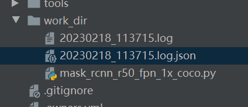

(5) 修改在work_dir下生成的`mask_rcnn_r50_fpn_1x_coco.py`：

因为我们是用自己的数据集进行训练，所以mmdetection会提供给我们一个可供修改的`mask_rcnn_r50_fpn_1x_coco.py`在工作目录中。直接点开它，我们需要修改这个文件的一些参数：

​	1.按ctrl+F 调出搜索框，输入num_classes，将80修改为你的分类数量（这里可以直接改，不用注释。因为这是生成给我们的、用于自定义的文件）：

```python
in_channels=256,
            fc_out_channels=1024,
            roi_feat_size=7,
            num_classes=2,		# 1、修改此处类别数量
            bbox_coder=dict(
                type='DeltaXYWHBBoxCoder',
                target_means=[0.0, 0.0, 0.0, 0.0],
                target_stds=[0.1, 0.1, 0.2, 0.2]),
```

2. 搜索img_scale，修改图片大小为你的实际图片大小（在3.2.1 第一节 [图片预处理](# 1、图片预处理)中，我已经把我的图片给resize成(400， 300)了)：

```python
img_scale=(400, 300)		#2、修改此处图片大小，为你的数据集实际图片的大小。
```

​	**注：这里一共有5处img_scale，均需要改成你自己的实际图片大小。**

3. 搜索data_root，修改你存放数据集文件的目录：

```python
data_root = 'data/coco/'	#3、修改此处数据集的文件目录
```

4. 搜索ann_file，修改训练集、验证集、测试集的文件路径（**共3处**）：

```python
    train=dict(
        type='CocoDataset',
        ann_file='data/coco/annotations/instances_train2017.json',		# 注意字典的名称，train用训练集
        img_prefix='data/coco/train2017/',								# 这里的目录改成train2017的图片目录
```

```python
    val=dict(
        type='CocoDataset',
        ann_file='data/coco/annotations/instances_val2017.json',		# val和test都用val
        img_prefix='data/coco/val2017/',								# 这里的目录改成val2017的图片目录
```

```python
    test=dict(
        type='CocoDataset',
        ann_file='data/coco/annotations/instances_val2017.json',		# val和test都用val
        img_prefix='data/coco/val2017/',								# 这里的目录改成val2017的图片目录
```

5. 搜索samples_per_gpu，修改每个gpu读取的图像数量和读取时每个gpu分配的线程数：

```python
data = dict(
    samples_per_gpu=2,		# 每个gpu读取的图像数量
    workers_per_gpu=2,		# 读取数据时每个gpu分配的线程数，一般设置为2
```

​	**注：** samples_per_gpu决定了训练时的batch_size。必须是2的倍数。如果samples_per_gpu=2，则batch_size=2

6. 搜索optimizer，修改学习率：

```python
optimizer = dict(type='SGD', lr=0.02, momentum=0.9, weight_decay=0.0001)		# 6、修改学习率
```

​	**注：**官方的说明文档中提到，学习率为0.02时，应有8个gpu。如果我们使用的gpu数量小于或大于8个，则应当按比例缩小或扩大学习率。例如：有4个gpu时，应该把学习率修改为0.01。我这里只有1个gpu，但是经过我的测试，如果把学习率设置为0.0025，训练完成后的准确率并不高。反而当学习率为0.02时，最后的准确率是最高的。**有关学习率设置的问题，只有自己多训练几次才能得到最适合的结果。**

---

**以下部分根据你的实际需求修改：**

7. 搜索checkpoint_config，修改interval：

```python
checkpoint_config = dict(interval=1)		# 7、修改checkpoint_config
```

​	**注：**这里默认为1，代表他每训练一轮，就会保存一次权重文件。这个文件的主要作用是在训练时发生断电等意外的时候，用于接着上一轮继续训练的。如果电脑内存不够，请适当调大。

8. 在下面一行中的log_config，修改interval：

```python
log_config = dict(interval=5, hooks=[dict(type='TextLoggerHook')])		# 8、修改log_config
```

​	**注：**这里是训练时输出的log日志信息，如果是50，那要50次迭代才会输出一次信息。因为我们训练的模型都比较小，所以改小一点。否则看不到正确率跟loss值的变化情况。

9. 下面还有一个load_from，正常情况是有预训练的权重文件的。如果是`load_from = None`，请修改为：

```python
load_from = 'checkpoints/mask_rcnn_r50_fpn_1x_coco_20200205-d4b0c5d6.pth'	# 9、修改load_from
```

​	**注：**这里是存放我们之前下载好的权重文件的路径。

10. 下面还有一个resume_from，默认是None。但是上面第7步设置checkpoint_config时候提到，如果真的发生断电等意外，我们可以修改这一项：

```python
resume_from = 'work_dir/epoch_8.pth'	# 比方说，如果训练到第九轮闪退了或者停电了，就可以在work_dir找到epoch_8.pth,把这个路径改一下
```

​	**注：**`resume_from`的优先级是大于`load_from`的，也就是说，如果你的`resume_from`有权重文件，那他会优先使用这个文件，不用又重新开始训练。

​	**(2023/3/4)注：**如果我们需要从头开始训练，这一行不用更改。

11. 最后还有个work_dir，这个目录是我们正式训练的时候输出log日志文件和epoch.pth这些轮次文件的目录，可以根据你的需要修改，但我的建议是别改：

```python
work_dir = 'work_dir'
```

---

(6) 修改完`work_dir/mask_rcnn_r50_fpn_1x_coco.py`配置后，请先把之前第(4)步存放在work_dir下的log后缀和json后缀文件删除，以免正式训练的时候搞混。(不过应该也不会搞混，这两个文件的命名规则是按照时间命名的，为了方便还是删了吧，反正也没用了)

(7) 然后在命令行输入下面的运行命令：

```shell
python tools/train.py work_dir/mask_rcnn_r50_fpn_1x_coco.py
```

​	**注：**后面的路径是work_dir下的、我们修改好的配置文件的路径。

##### 2、可能遇到的报错

(1) `ValueError: need at least one array to concatenate`

​		检查数据集路径是否正确；检查json里边的类名和代码里的类名是否对应。如果没问题，请跳转到[3.2.3   1、修改配置文件](# 1、修改配置文件)中的第三步，重新运行一次setup.py。

(2) `AssertionError: The num_classes (3) in Shared2FCBBoxHead of MMDataParallel does not matches the length of CLASSES 80) in CocoDataset`

​		如果修改coco.py、class_names.py之后仍然报这个错，就需要改动源环境里的源码了。我们下载的mmdetection-master目录下只是一些python文件，真正运行的还是环境里的源文件。找到下面的两个目录：

```shell
~/anaconda/envs/mmlab/Lib/site-packages/mmdet/core/evaluation/class_names.py
~/anaconda/envs/mmlab/Lib/site-packages/mmdet/datasets/coco.py
```

​		这里的目录是你anaconda的虚拟环境里，安装package的位置。（我们最开始mim install mmdet安装的工具包就是安装在这个位置，这里文件与我们在github上下载的mmdetection-master是相同的，但是编译的时候，linux下走的是这里的路径。我用的是windows，同样出现了这个报错。）

##### 3、结果可视化

训练过程中的一些数据都是存在log.json和log两个文件里面的。我们点开其中json后缀的文件。可以看到大量字典存储在其中，阅读起来十分不方便。为了后续的展示，我们要将我们的运行结果做一个可视化处理。

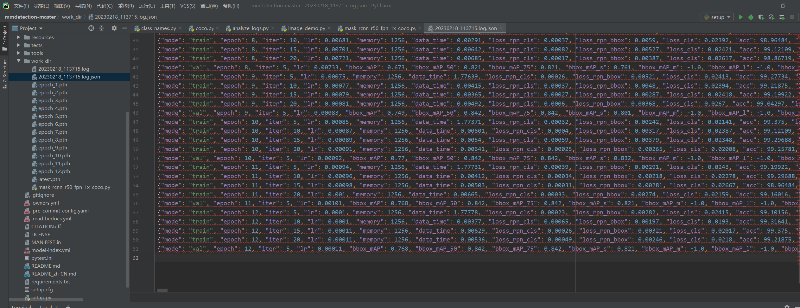

在根目录下的tools中，我们找到analysis_logs.py。这个脚本是官方提供的分析logs的一个工具。在命令行中运行下列代码：

```shell
python tools/analysis_tools/analyze_logs.py plot_curve work_dir/20230218_113715.log.json --keys acc
```

**注：**--keys acc是我们在json文件中的索引，该脚本会自动索引其所对应的参数，并绘制到折线图中。也可以换成别的参数，比如loss_cls等。

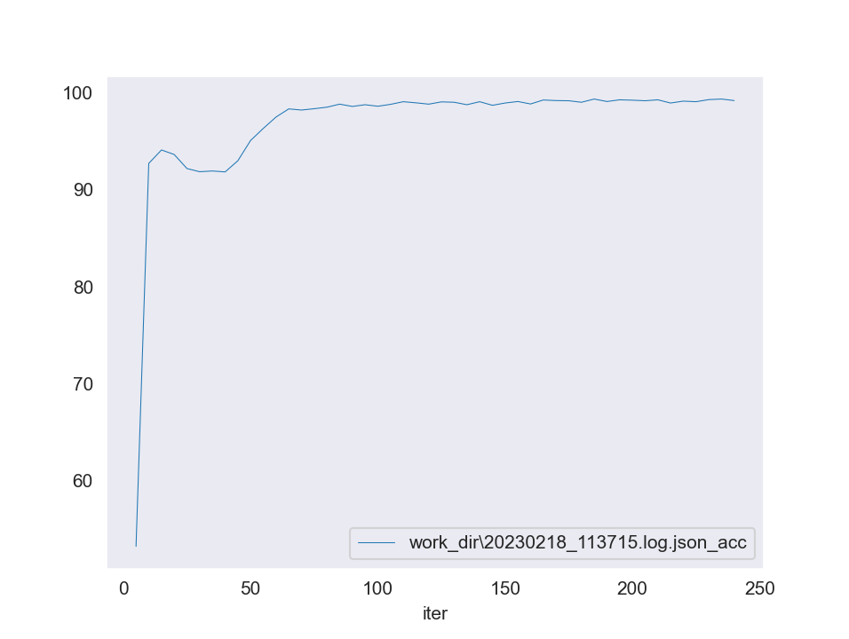

如果我们想在一个折线图中看到多个数值的变化趋势，比如loss值。那我们可以在命令行中输入：

```shell
python tools/analysis_tools/analyze_logs.py plot_curve work_dir/20230218_113715.log.json --keys loss_cls loss_bbox loss_mask
```

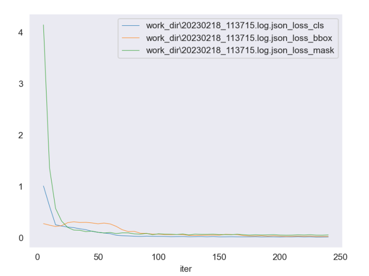

如果需要保存输出的折线图，可以在后面加上--out out.pdf（也可以是png、jpg后缀的）：

```shell
python tools/analysis_tools/analyze_logs.py plot_curve work_dir/20230218_113715.log.json --keys loss_cls loss_bbox loss_mask --out work_dir/out.pdf
```

运行后，在work_dir下就会产生这个折线图的文件了。

然后我们也需要用我们训练好的模型来进行检测，这时候的操作其实跟我们之前用到的demo检测图片的方法差不多。在命令行输入：

```shell
python tools/test.py work_dir/mask_rcnn_r50_fpn_1x_coco.py work_dir/epoch_12.pth --show
```

验证的图片默认是抽取我们之前放在测试集`data/coco/val2017`的图片，因为我的数据集很少，所以很早就过拟合了，准确率很高：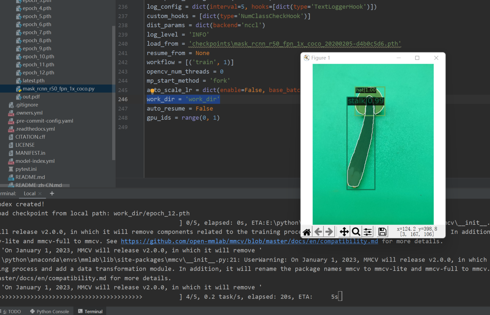


有关mmdetection的使用差不多到这里就够用了。如果需要更深入地了解与使用，请参考官方文档提供的[教程](https://mmdetection.readthedocs.io/zh_CN/stable/)。
